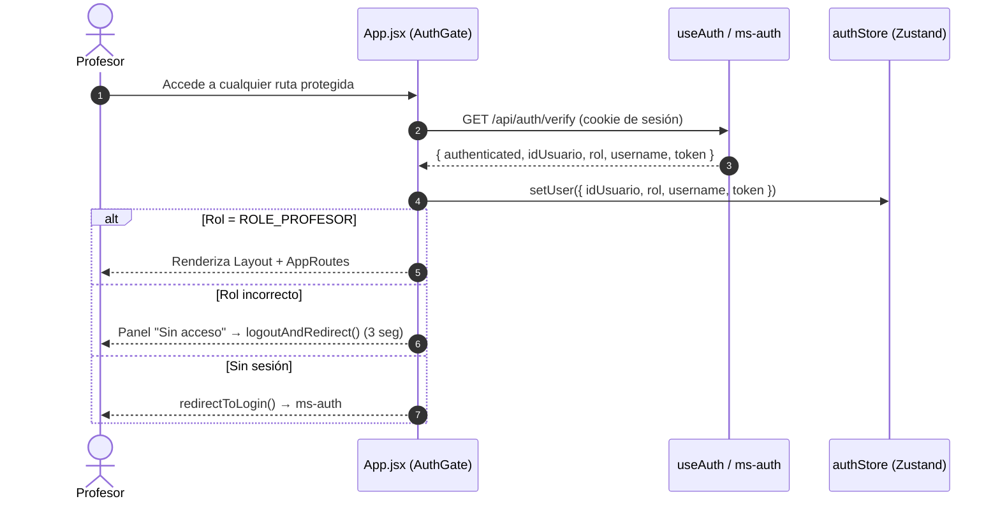
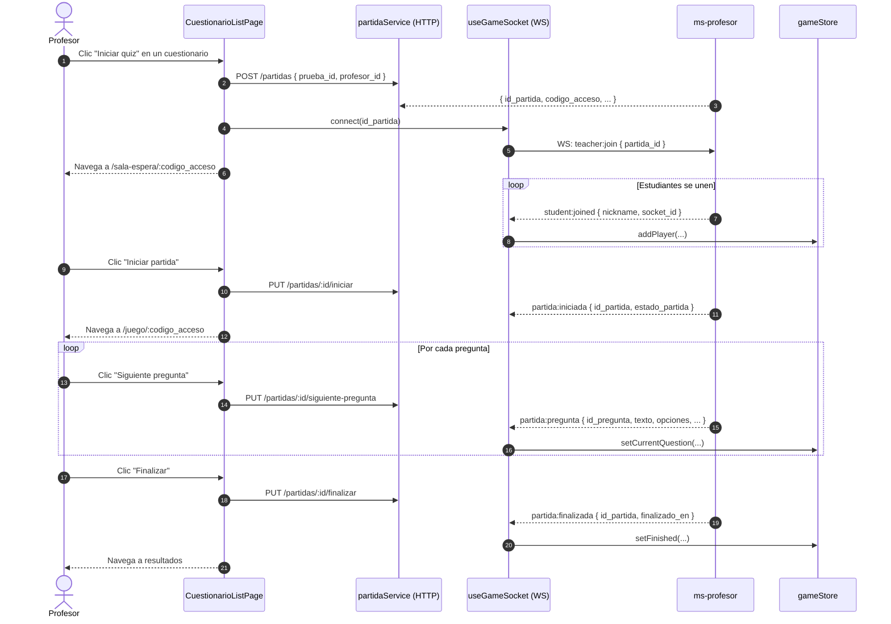

[← Volver al índice](INDEX.md)

# 🏗️ Arquitectura del Sistema - eduLLM-Front-Profesor

Este documento describe la estructura de componentes, el sistema de rutas, la gestión de estado y los flujos de datos del frontend del módulo Profesor.

---

## 1. Stack tecnológico

| Capa | Tecnología |
|---|---|
| Framework UI | React 18 + Vite |
| Estilos | Material UI 5 + Tailwind CSS |
| Rutas | React Router DOM 6 |
| Estado global | Zustand 4 |
| Fetching / caché | TanStack React Query 5 |
| Formularios | React Hook Form 7 + Zod |
| HTTP | Axios 1.6 |
| WebSocket | Socket.io-client 4.7 |

---

## 2. Estructura de directorios

```
src/
├── App.jsx                    # Raíz de la app — AuthGate + BrowserRouter
├── main.jsx                   # Entry point
├── theme.js                   # Tema MUI personalizado
├── routes/
│   └── AppRoutes.jsx          # Definición de rutas protegidas
├── components/
│   ├── common/                # LoadingScreen, ConfirmDialog, Layout
│   └── layout/                # Header, Sidebar
├── features/
│   ├── dashboard/             # DashboardPage + useDashboard
│   ├── cuestionarios/         # CuestionarioListPage, CuestionarioEditorPage + hooks
│   ├── partidas/              # HistorialPartidasPage, SalaEsperaPage, JuegoPage + hooks
│   └── cursos/                # CursosPage + useCursos
├── hooks/
│   ├── useAuth.js             # Verificación de sesión con ms-auth
│   └── useGameSocket.js       # Socket.io — solo recepción de eventos
├── services/
│   ├── api.js                 # Cliente axios base con interceptores
│   ├── dashboardService.js
│   ├── cuestionarioService.js
│   ├── partidaService.js
│   └── materiaService.js
├── stores/
│   ├── authStore.js           # Zustand — sesión del profesor
│   └── gameStore.js           # Zustand — estado en tiempo real del juego
└── utils/
    ├── auth.js                # redirectToLogin, logoutAndRedirect, decodeToken
    └── sanitize.js            # Sanitización de inputs antes del envío
```

---

## 3. Flujo de autenticación (AuthGate)



**Variable de entorno:** `VITE_SKIP_AUTH_VERIFY=true` salta la verificación en desarrollo local.

---

## 4. Flujo completo del juego (Partida)



---

## 5. Arquitectura de la capa de datos

```
Componente / Página
    │
    ▼
Hook de feature (usePartidas, useCuestionarios, useDashboard...)
    │  usa React Query (useQuery / useMutation)
    ▼
Service (partidaService, cuestionarioService...)
    │  usa axios instance
    ▼
api.js (cliente base)
    │  interceptors: Authorization header + profesor_id param
    ▼
Gateway (http://localhost:8085/api/profesor/...)
    │  inyecta X-User-Id, X-User-Role, X-Username
    ▼
ms-profesor (backend)
```

---

## 6. Decisiones técnicas clave

- **HTTP para control de partida, Socket.io solo para push:** el estado del juego vive en la base de datos. Si el socket se cae, el control HTTP continúa funcionando. Los comandos (iniciar, siguiente, finalizar) son REST; los eventos (partida:pregunta, student:joined) son WebSocket.
- **`profesor_id` auto-inyectado en el interceptor:** se lee `idUsuario` del `authStore` en cada request, evitando que cada servicio lo gestione manualmente.
- **React Query para caché y sincronización:** `invalidateQueries` en mutaciones garantiza que las listas se refresquen automáticamente tras crear/eliminar recursos.
- **Zustand para estado del juego en tiempo real:** permite que múltiples componentes (`SalaEsperaPage`, `JuegoPage`) lean el estado del juego sin prop-drilling.

---

> **Nota para IA:** Si se añade una nueva feature o se cambia el flujo de la partida, actualiza los diagramas Mermaid de este archivo.

---

## Última revisión
- **Fecha:** 2026-06-17
- **Versión:** 1.1.0

---

## Instrucciones para actualizar este doc
- Si cambia el flujo de auth o el flujo del juego → actualiza los diagramas de secuencia.
- Si cambia la estructura de directorios → actualiza la sección 2.

[← Volver al índice](INDEX.md)
