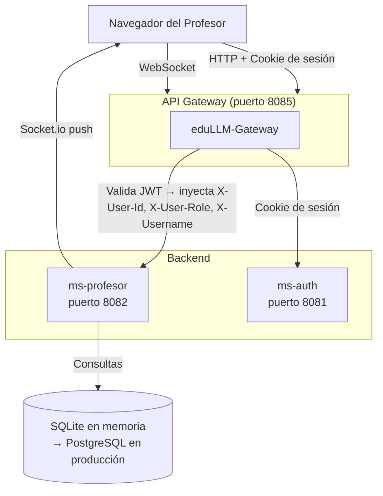

[← Volver al índice](INDEX.md)

# 🌐 Integraciones - eduLLM-Front-Profesor

Describe cómo este frontend se comunica con el ecosistema de microservicios de EduLLM.

---

## Diagrama de integración

---

## ms-auth

**Propósito:** Autenticación y gestión de sesión.

| Endpoint | Desde | Uso |
|---|---|---|
| `GET /api/auth/verify` | `useAuth.verifyAuth()` | Verifica la cookie de sesión y devuelve `{ idUsuario, rol, username, token }` |
| `POST /api/auth/logout` | `logoutAndRedirect()` | Invalida la cookie de sesión antes de redirigir al login |

La respuesta de `verify` se guarda en `authStore`. El campo `idUsuario` se usa como `profesor_id` en todas las peticiones a `ms-profesor`.

---

## ms-profesor (via Gateway)

**Base URL:** `VITE_GATEWAY_URL/api/profesor` → `http://localhost:8085/api/profesor`

Todos los endpoints REST y el WebSocket están detallados en [API.md](API.md) y [SOCKET.md](SOCKET.md).

### Headers que inyecta el Gateway

El Gateway valida el JWT de la request y añade al forward:

| Header | Valor | Uso en backend |
|---|---|---|
| `X-User-Id` | `idUsuario` del JWT | Identidad del profesor en cada request |
| `X-User-Role` | `ROLE_PROFESOR` | Validación de rol |
| `X-Username` | `username` del JWT | Logging y auditoría |

### Headers que envía el frontend

| Header | Fuente | Descripción |
|---|---|---|
| `Authorization: Bearer {token}` | `localStorage.jwtToken` | Interceptor de `api.js` |
| `Cookie` | Navegador (automático) | Cookie de sesión para `withCredentials: true` |

---

## Variables de entorno

| Variable | Default | Descripción |
|---|---|---|
| `VITE_GATEWAY_URL` | `http://localhost:8085` | URL base del API Gateway |
| `VITE_AUTH_URL` | `{GATEWAY}/login` | URL de login del ms-auth |
| `VITE_SKIP_AUTH_VERIFY` | `false` | `true` para saltar verificación en dev local |

---

## Base de datos

El `ms-profesor` usa **SQLite en memoria** durante el desarrollo. La migración a **PostgreSQL** se realizará en producción sin cambios en el frontend — el contrato de API REST y Socket.io no cambia con el motor de base de datos.

---

> **Nota para IA:** Si se añade un nuevo microservicio al ecosistema (ej: ms-rag, ms-cuestionarios) → añade su sección aquí describiendo los endpoints que consume el frontend.

---

## Última revisión
- **Fecha:** 2026-06-17
- **Versión:** 1.1.0

---

## Instrucciones para actualizar este doc
- Si cambia la URL del Gateway o de algún microservicio → actualiza la tabla de variables de entorno.
- Si se integra un nuevo servicio externo → añade su sección.

[← Volver al índice](INDEX.md)
